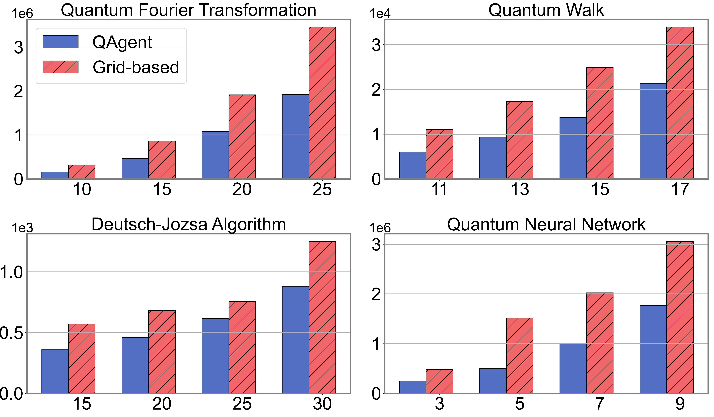

# Agent-per-Qubit: AI-Driven Qubit Placement for Efficient Quantum Computing


>Overview of the proposed QAgent framework. (1) Each agent receives the current state from the environment and utilizes a Proximal Policy Optimization (PPO) module, comprising both a policy network and a value function (critic). The policy network determines the action, which corresponds to the placement of a qubit on the processor. (2) The environment models the quantum processor and qubit layout. Relevant information is extracted via a convolutional neural network (CNN) and provided to the agent as the state representation. The cost is defined as the number of ancilla qubits used in routing regions. (3) Historical costs are tracked; if the current cost is lower than the previously observed minimum, a Breakthrough Return Bonus is granted. Otherwise, the reward is computed using the standard reward function.

## Get started

1. download code

```
git clone https://github.com/Eliment-li/AiQLayout.git
```
2. install requirements:
   We recommend **Anaconda** as Python package manager.

```setup
To create python environment with conda, use:
conda create --name qlayout python=3.11

To activate this environment, use:
conda activate qlayout

To install requirements, use:
pip install -r requirements.txt
```

The  **Pytorch**  package is also required, For **Windows**, the Pytorch  is already installed  by run "pip install -r requirements.txt":

For **Linux** or to install Pytorch with GPU,  please see [Pytorch Get Started](https://pytorch.org/get-started/locally/)

### Large-Scale training
We use  **Redis** to store temp data, redis is a high performance memory management system.
A simple official installation tutorial is available at https://redis.io/docs/latest/operate/oss_and_stack/install/


## Configuration

1. you have the option to utilize the default settings or customize the important items in the **conf/run.xml** 
2. A private.yaml is also need to setup the redis password and wandb token. below is an example:
>private.yaml

```yaml  
swanlab_key: 
swanlab_project: my_project 
upload_checkpoints_to_wandb: False
wandb_run_name: None
save_render_img: True

#redis_ip: 172.26.192.168
redis_ip: 127.0.0.1
redis_port: 6379
redis_password: (the default password is empty)
```

## Training

To train the model, run command:

```train
python  -B -O run.py -i 10
```

## Results

>a comparison of total execution costs between QAgent and grid-based layout strategies across various quantum circuits. The x-axis represents the circuit size (number of qubits), while the y-axis indicates the total execution cost, defined as the number of ancilla qubits required for circuit completion.
The results indicate that QAgent outperforms the grid-based layout for most quantum circuits, reducing costs by 42.62% on average. Furthermore, the placements suggested by QAgent on the quantum chip significantly decrease total execution costs, potentially mitigating quantum error accumulation and resulting in higher overall fidelity.


# Details of reproduction
The code is tested on server with 1 GPU or 0 GPU(only CPU) 
If wish to try multi GPU to train, please see https://docs.ray.io/en/latest/rllib/package_ref/algorithm-config.html#rllib-config-learners

And check enhance_config() function to make sure the config is correct

## Chip Size
For sparse layout, there are three chip size:
- 10x10 for 0  < qubits number <= 15
- 12*12 for 15 < qubits number <= 25
- 15*15 for 25 < qubits number <= 49

If there are corrupted qubits in the chip, the qubits number above is also reduced


## Qasm
the qreg will in qasm file wil be merge into one qreg, and the qasm file will be modified to use the merged qreg
